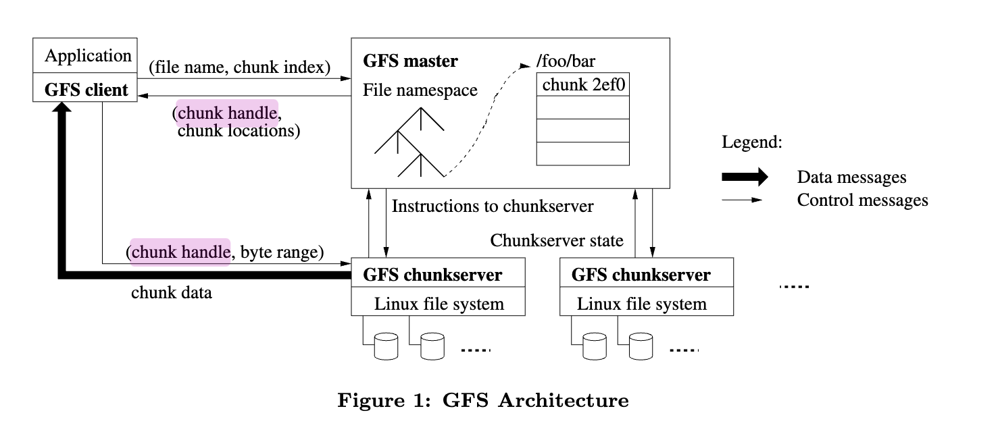
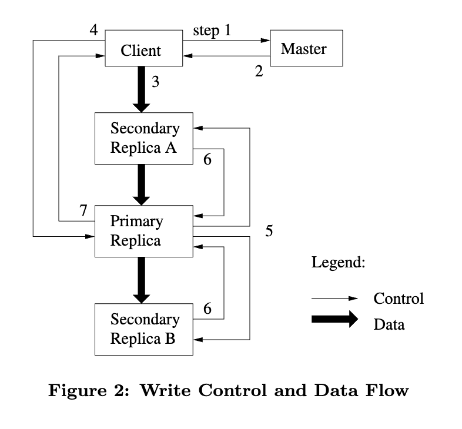

# GFS-goole file system

论文链接：http://nil.csail.mit.edu/6.824/2020/papers/gfs.pdf

gfs由一个master和多个chunkserver组成，file被master分割成固定大小的数据块被存储在各个chunk server的本地磁盘中，chunk通过master为其分配的64位的chunk handle来统一标识

master中存储了：

* 文件和目录的命名空间
* 文件到块的映射
* chunk meta data：chunk handle，chunk版本号，chunk副本位置，lease信息
* operation log

### Read file

1. ##### **客户端计算文件偏移量和块索引**：

   - 基于文件路径和读取字节偏移量（offset），客户端将偏移量转换为一个块索引（chunk index）。

2. **客户端向Master请求块信息**：

   - 客户端发送请求到Master，其内容包括文件路径和块索引。
   - **Master响应**：Master返回对应块的chunk handle（块标识）和所有副本的位置信息。

3. **客户端缓存块信息**：

   - 客户端将从Master获取的块信息（chunk handle和副本位置）缓存起来，以减少后续的请求。
   - 缓存的键一般是文件路径和块索引。

4. **客户端选择合适Chunkserver进行数据读取**：

   - 客户端从返回的副本列表中选择一个Chunkserver读取数据，通常选择最靠近的数据副本以优化性能和减少延迟。
   - 客户端发送读取请求到选定的Chunkserver，请求包含块标识（chunk handle）及偏移和读取长度。

5. **Chunkserver返回数据**：

   - 选定的Chunkserver从它本地存储中读取相应的块数据，然后返回给客户端。

6. **客户端处理数据**：

   - 客户端接收数据并处理，如果请求的数据量较大且跨越多个块，那么客户端将重复步骤1到步骤5，直到获取所有需要的数据。

### Write

在GFS中，Primary和Secondary这两个角色用于管理数据块在多个副本（replica）之间的一致性和协调工作，而不特指某些固定的服务器，而是特指担当特定块副本操作角色的Chunkserver。在对某个数据块执行写操作时，GFS会临时指定某个副本为Primary，其它副本为Secondary，用以协调数据的复制和一致性。

**lease mechinism：**

* **lease**:在一段时间内让一个chunk成为primary，可以有效避免chunk一直向master确认自己是否还是primary和多primary的出现

- **Primary角色**：在对某个块写操作时，Master节点会授予某个副本的租约，使其充当该块的Primary。Primary负责协调写操作的顺序，确保多个客户端写入数据的一致性和有序性。
- **Secondary角色**：其他副本为Secondary，它们从Primary接收更新指令并应用写操作，确保最终数据与Primary的保持一致。

1. **客户端请求元数据**（步骤1，2）：客户端通过Master获取目标数据块及副本信息。
2. **数据推送**（步骤3）：客户端推送数据到所有副本缓存。
3. **写请求**（步骤4）：客户端发送写请求到Primary。
4. **序列化应用**（步骤5）：Primary分配序列号并应用变更。（因为可能同时有多个client并发的请求向chunk中写入数据，所以需要primary分配执行顺序）
5. **转发变更**（步骤6）：Primary转发写请求到所有Secondary副本，Secondary副本根据序列号应用变更。
6. **确认完成**（步骤7）：Secondary副本确认完成变更，Primary回复成功给客户端。